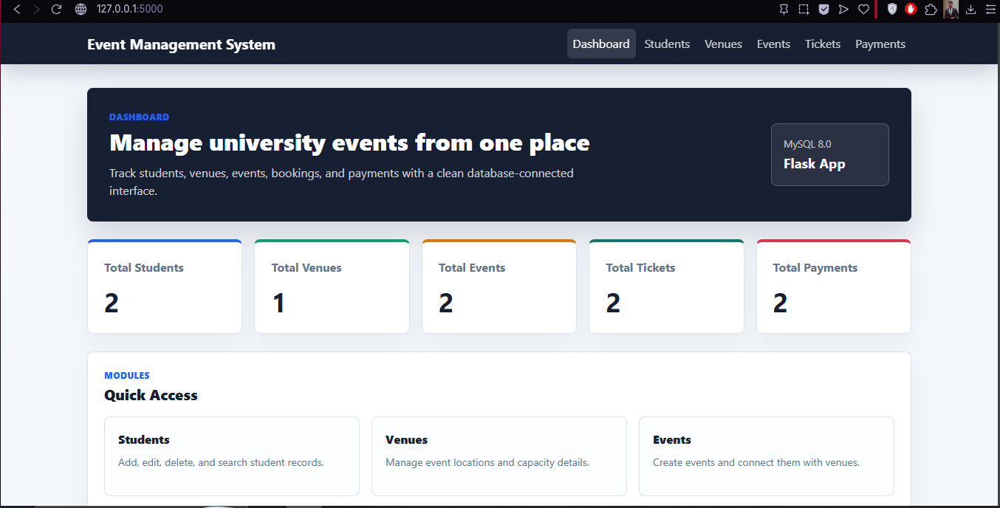
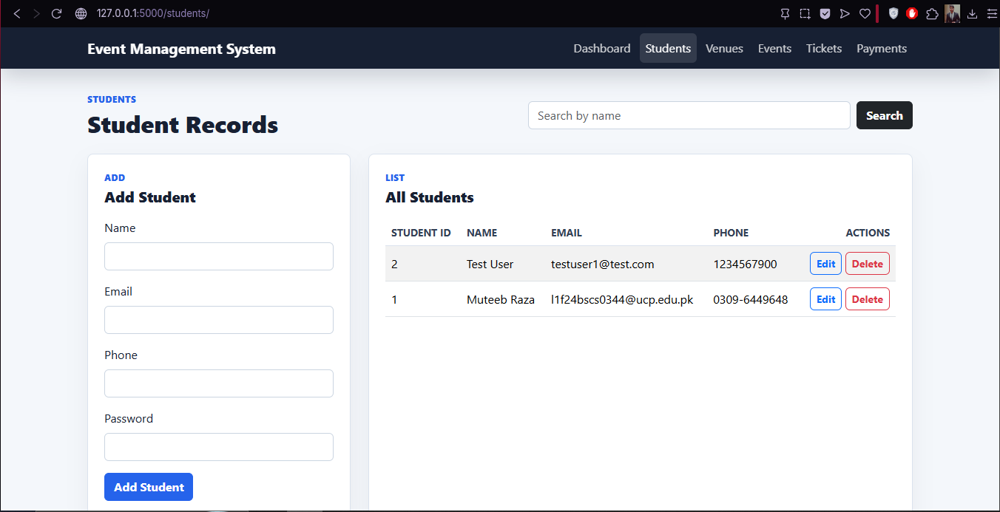
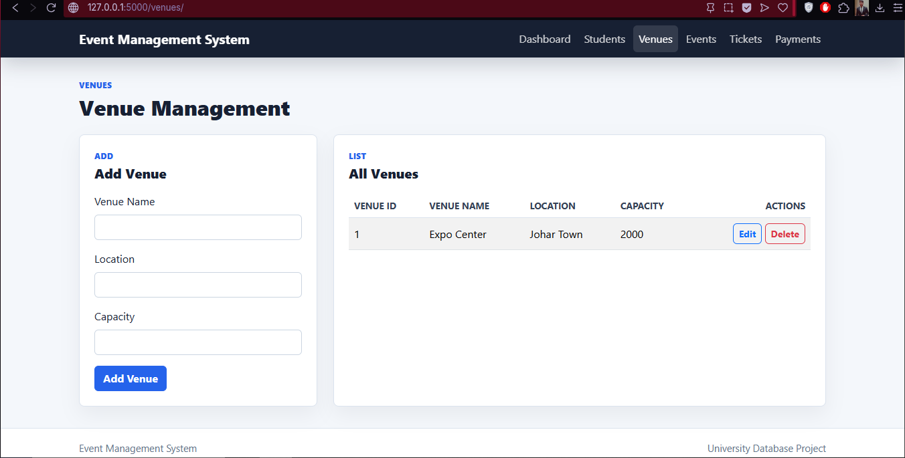
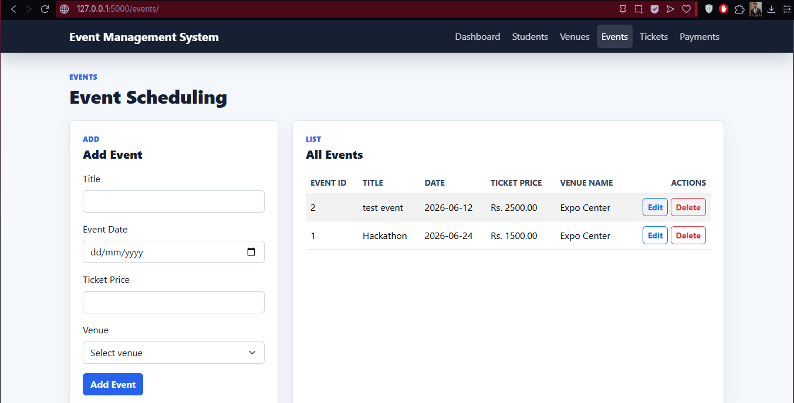
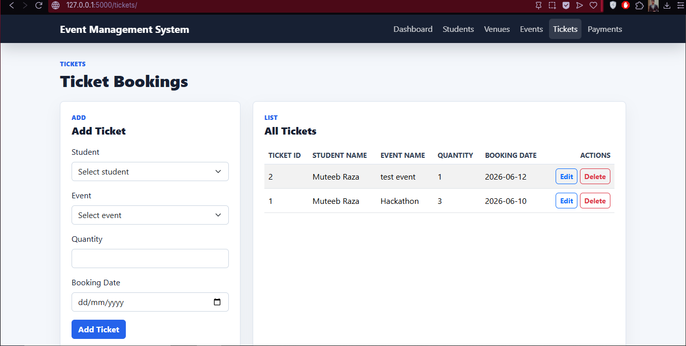
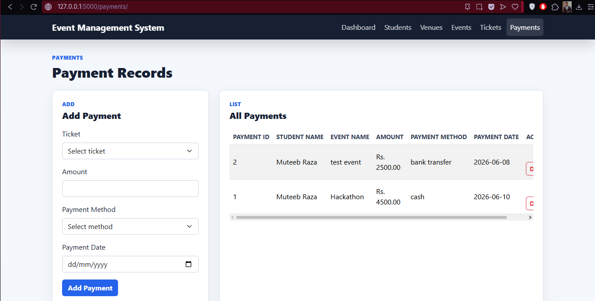

# Event Management System

## Project Description

The Event Management System is a database-driven web application developed using Flask and MySQL. The system allows users to manage students, venues, events, ticket bookings, and payments through a user-friendly web interface.

This project was developed as part of a Database Systems course to demonstrate the practical implementation of database concepts including relational database design, primary and foreign keys, stored procedures, CRUD operations, and web-based database interaction.

---

## Features

### Dashboard

* Displays total number of Students
* Displays total number of Venues
* Displays total number of Events
* Displays total number of Tickets
* Displays total number of Payments

### Student Management

* Add Student
* View Students
* Update Student Information
* Delete Student
* Search Students by Name

### Venue Management

* Add Venue
* View Venues
* Update Venue Information
* Delete Venue

### Event Management

* Add Event
* View Events
* Update Event Information
* Delete Event
* Assign Events to Venues

### Ticket Management

* Book Tickets
* View Ticket Records
* Update Ticket Quantity
* Cancel Tickets

### Payment Management

* Record Payments
* View Payment Records
* Update Payment Information
* Delete Payment Records

### Additional Features

* Responsive Bootstrap 5 User Interface
* Navigation Dashboard
* Success and Error Alerts
* Delete Confirmation Dialogs
* Database Error Handling
* Stored Procedure Integration

---

## CRUD Operations

The application implements full CRUD (Create, Read, Update, Delete) functionality for:

* Students
* Venues
* Events
* Tickets
* Payments

---

## Database Design

The system consists of the following entities:

### Students

Stores student information including name, email, phone number, and password.

### Venues

Stores venue information including venue name, location, and capacity.

### Events

Stores event details including title, date, ticket price, and assigned venue.

### Tickets

Stores ticket bookings associated with students and events.

### Payments

Stores payment records associated with ticket bookings.

### Relationships

* One Venue can host multiple Events.
* One Event belongs to one Venue.
* One Student can book multiple Tickets.
* One Event can have multiple Ticket Bookings.
* One Ticket can have associated Payment Records.

Foreign key constraints are used to maintain referential integrity throughout the database.

---

## Technology Stack

### Backend

* Python
* Flask

### Frontend

* HTML5
* CSS3
* JavaScript
* Bootstrap 5

### Database

* MySQL 8.0

### Database Connector

* mysql-connector-python

### Template Engine

* Jinja2

---

## Stored Procedures

The database uses stored procedures to perform CRUD operations.

### Student Procedures

* add_student
* get_student
* update_student
* delete_student

### Venue Procedures

* add_venue
* get_venue
* update_venue
* delete_venue

### Event Procedures

* add_event
* get_event
* update_event
* delete_event

### Ticket Procedures

* add_ticket
* get_tickets
* update_ticket
* delete_ticket

### Payment Procedures

* add_payment
* get_payments
* update_payment
* delete_payment

---

## Project Structure

```text
Event_management_system/
├── database/
│   └── event_management.sql
│
├── backend/
│   ├── app.py
│   ├── db.py
│   ├── routes/
│   │   ├── students.py
│   │   ├── venues.py
│   │   ├── events.py
│   │   ├── tickets.py
│   │   └── payments.py
│   └── requirements.txt
│
├── templates/
│   ├── base.html
│   ├── index.html
│   ├── students.html
│   ├── venues.html
│   ├── events.html
│   ├── tickets.html
│   └── payments.html
│
├── static/
│   ├── css/
│   └── js/
│
├── README.md
└── .gitignore
```

---

## Installation Instructions

### 1. Clone the Repository

```bash
git clone <repository-url>
cd Event_management_system
```

### 2. Install Dependencies

```bash
pip install -r backend/requirements.txt
```

---

## Database Setup

### 1. Open MySQL Workbench

Open the SQL script:

```text
database/event_management.sql
```

### 2. Execute the Script

Run the complete SQL script to create:

* Database
* Tables
* Relationships
* Stored Procedures

### 3. Verify Database Name

```text
event_management
```

### 4. Configure Database Connection

Open:

```text
backend/db.py
```

Update the database credentials if necessary:

```python
host="localhost"
user="root"
password="YOUR_PASSWORD"
database="event_management"
```

---

## Running the Application

From the project root directory:

```bash
python backend/app.py
```

Open your browser and visit:

```text
http://127.0.0.1:5000
```

---

## Screenshots

### Dashboard



### Student Management



### Venue Management



### Event Management



### Ticket Management



### Payment Management



---

## Error Handling

The system includes handling for:

* Duplicate email addresses
* Invalid database references
* Missing form fields
* Database connection failures
* Invalid user input

User-friendly messages are displayed through Bootstrap alerts.

---

## Academic Objectives Demonstrated

This project demonstrates the following database concepts:

* Relational Database Design
* Entity Relationships
* Primary Keys
* Foreign Keys
* Stored Procedures
* CRUD Operations
* Data Integrity Constraints
* Database Connectivity
* Dynamic Web Applications
* Client-Server Architecture

---

## Notes

* The application uses stored procedures for CRUD operations whenever possible.
* List pages and dropdown menus use SELECT queries where appropriate.
* All data modifications are persisted directly in the MySQL database.

---

